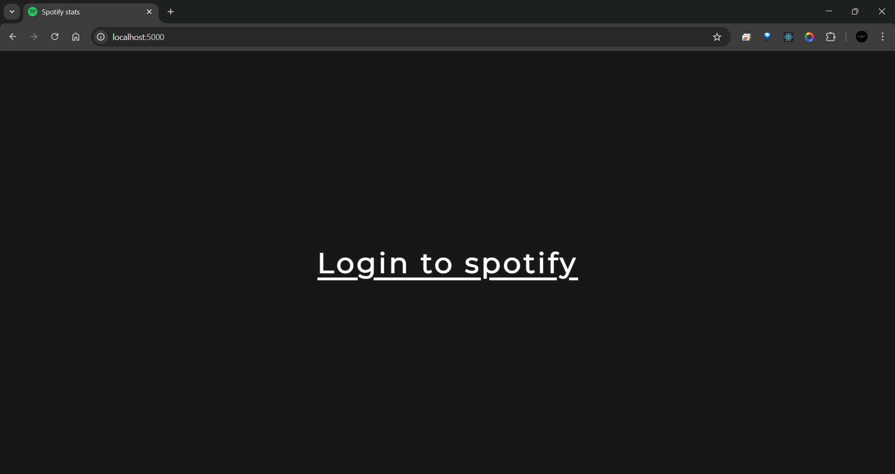
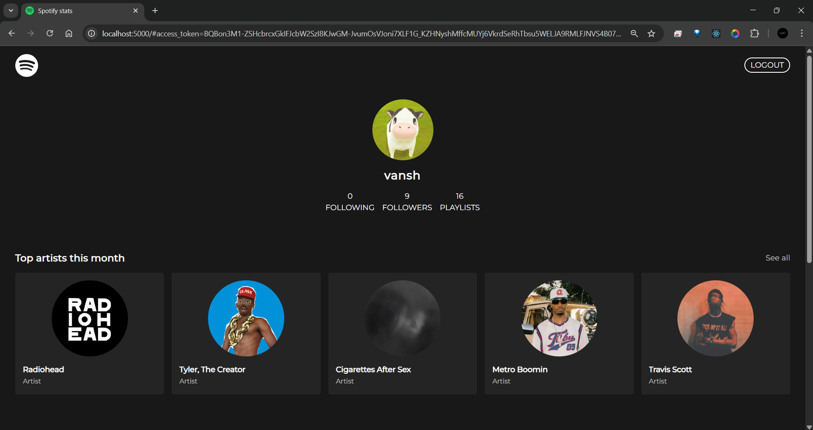
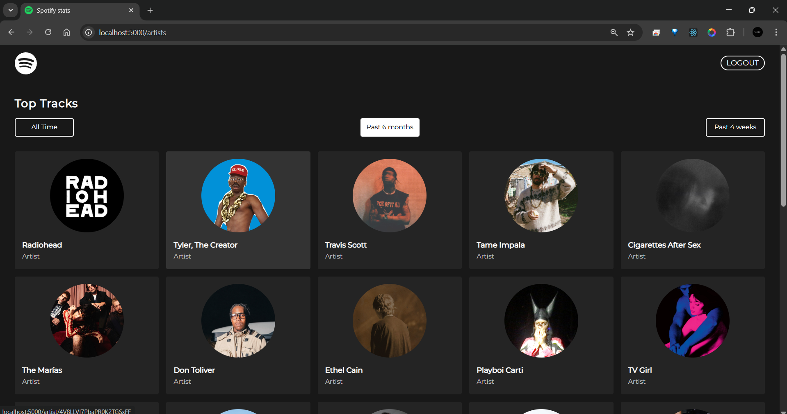

# Spotify Stats

A web app that uses the Spotify API to show personalized user statistics such as top tracks, top artists, and recently played songs.


## Features

- View your **Top Artists** and **Top Tracks**
- See your **Recently Played** songs
- Secure Spotify **OAuth2.0** login
- Fast and responsive interface
- Uses Spotify Web API to fetch real-time listening data


## Setup

### Prerequisites

- [Node.js](https://nodejs.org/)
- npm or yarn
- Spotify Developer Account

### Spotify Developer Setup

1. Go to the [Spotify Developer Dashboard](https://developer.spotify.com/dashboard/)
2. Create a new app
3. Copy the **Client ID** and **Client Secret**
4. Set the **Redirect URI** (e.g., `http://localhost:8000/callback`)


### Cloning the Repository

To get started locally, clone the repository with:

```bash
git clone https://github.com/vanxhh/Spotify-stats.git
cd Spotify-stats
```


### Environment Variables

Create a `.env` file in the root directory and add the following:

```env
CLIENT_ID=your_spotify_client_id
CLIENT_SECRET=your_spotify_client_secret
REDIRECT_URI=http://localhost:8000/callback
FRONTEND_URI=http://localhost:8000
```

### Building the Client

From the root directory, navigate to the `client` folder and install dependencies:

```bash
cd client
npm install
npm run build
```

### Running the Server

From the root directory, start the server with:

```bash
node server/index.js
```


## Screenshots

###  Login Page
  

###  Home Page
  

###  Listening Activity

